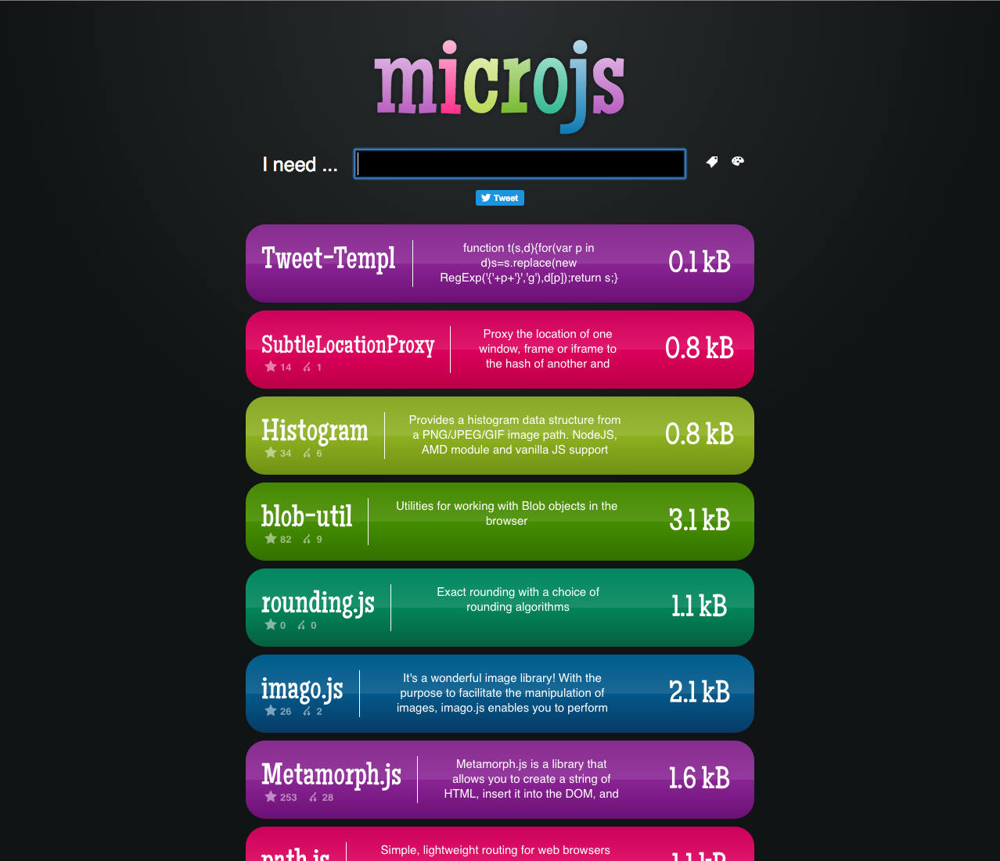
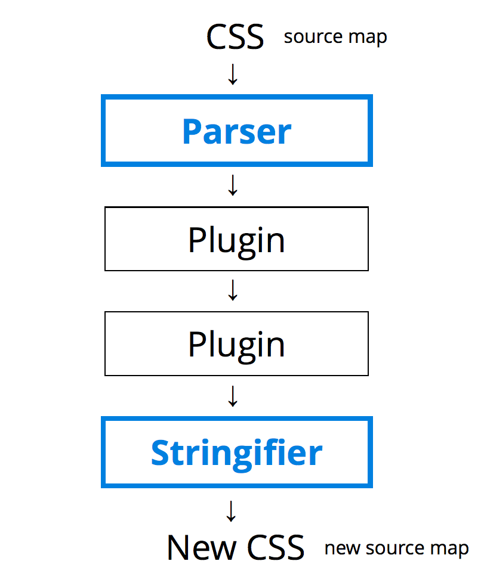

# [fit] PostCSS
## is for everybody

---

# Hi, I'm Nathan

^ Introduce yourself, but not too much

---

# [fit] CSS

^ this is a javascript thing, but today we're going to talk about CSS

---

# Remember 1996?

^ Bob Dole wanted to be the President
^ We got so many Jerry Maguire quotes
^ The Information Super highway was going to save us all

---

```
    /* CSS level 1 */

    DIV P           { font: small sans-serif }
    .reddish H1     { color: red }
    #x78y CODE      { background: blue }
    DIV.sidenote H1 { font-size: large }
    P {
      color: black;
      background: white;
      border: solid;
    }
```
^ The W3C Recommended CSS level 1, so we could stop inlining style information in HTML

---

# CSS Zen Garden
## Dave Shea in 2003

^ Years later, Dave Shea showed us how legit CSS could be with CSS Level 2 and floating divs instead of just putting everything in a table

---

```
    /* css Zen Garden default style ... */
    /* ... 2003, Dave Shea */
    /* Added: May 7th, 2003 */
    header h1 {
      background: transparent url(h1.gif) no-repeat top left;
      margin-top: 10px;
      display: block;
      width: 219px;
      height: 87px;
      float: left;

      text-indent: 100%;
      white-space: nowrap;
      overflow: hidden;
    }
    /* etc, etc, etc */
```

---

## CSS is declarative
### Read: *repetative*

---

```
    .sidebar a { color: hotpink }

    .widget .title { color: hotpink }
    .widget .copy { font-size: 15px; }
    .widget .cta { color: hotpink }

    .header { font-family: Garamond, sans-serif; }
    .fancy-content p { font-family: Garamond, sans-serif; }
    .footer .about-us { font-family: Garamond, sans-serif; }
```

---

# But we fixed that

---

## with Sass
### 2005, Ruby

---

```
        $accent: hotpink;
        $dope-font: Garamond, sans-serif;

        @mixin accent-type {
          font-family: $dope-font;
          font-style: italic;
        }

        .sidebar a { color: $accent }

        .widget {
          .title { color: $accent }
          .copy { font-size: 15px; }
          .cta { color: $accent }
        }

        .header,
        .fancy-content p,
        .footer .about-us {
          @include accent-type;
        }
```

---

## then Less
### 2009, JavaScript

---

```
        @accent: hotpink;
        @dope-font: Garamond, sans-serif;

        .accent-type () {
          font-family: @dope-font;
          font-style: italic;
        }

        .sidebar a { color: @accent }

        .widget {
          .title { color: @accent }
          .copy { font-size: 15px; }
          .cta { color: @accent }
        }

        .header,
        .fancy-content p,
        .footer .about-us {
          .accent-type
        }
```

---

## then Stylus
### 2011, JavaScript

---

```
        accent = hotpink
        dope-font = Garamond, sans-serif

        accent-type()
          font-family dope-font

        .sidebar a
          color accent

        .sidebar a
          color accent

        .widget
          .title
            color accent
          .copy
            font-size 15px
          .cta
            color accent

        .header,
        .fancy-content p,
        .footer .about-us
          accent-type()
```

---

# So problem solved, right?

^ With all this power all of our problems were solved, and now we bask in the perfect future of CSS

^ Well not quite

---

## Sass, Less, and Stylus all have

- Variables
- Inheritance
- Mixins
- Importing
- Nesting

^ Preprocessors gave us mostly all of the same features

---

## And we tried to use *ALL* the features for a while

---


^ We're familiar with the concept of not needing to use everything in a langage

---




^ And we've also had conversations about using more modular tools in favor of more robust libraries to get only the features we want

---

## Platform vs Library


^ currently we are discussing a robust, opinionated eco-system vs a flexible one with a daunting amount of choices to make

---

## What if we don't want to use all the features of a Preprocessor?

---

## How do we add features?

---

## The evolution of Preprocessors

---

# TJ had an idea

> ... Rework caters to a different audience, and provide
> you the flexibility to craft the preprocessor you want,
> not the choices the author(s) have force on you.
-- TJ Holowaychuk

_[modular-css-preprocessing-with-rework](http://tjholowaychuk.tumblr.com/post/44267035203/modular-css-preprocessing-with-rework)_

---

# Andrey took it and ran with it

> Because Rework was a proof of concept, it was the first generation of modular CSS processing. With PostCSS we have a better parser, a better API, and better source map support.
-- Andrey Sitnik

---

# So how does it work?



^ So PostCSS parses your CSS and provides an API for plugins to manipulate it

---

## So how does it work?
### Using PostCSS
```js
    const postcss = require('postcss');

    postcss([ plugin1, plugin2 ])
        .process(css)
        .then( result => {
          /* do something with result.css */
        });
```

^ So PostCSS actually does very little, all the power comes from Plugins

---

## So how does it work?
### writing a plugin

```js
    // a PostCSS plugin
    function (css) {
      css.walkRules( rule => {
          rule.walkDecls( decl => {
            // manipulate decl.value here
          });
      });
    };
```

---

# Replacing Sass

+ postcss-simple-vars
+ postcss-nested
+ postcss-mixins
+ postcss-custom-media
+ postcss-color-function

^ To get most of the basic features of Sass, all we need is a couple handfuls of plugins

---

## Take it to the future!
# Use CSSNext

> PostCSS-cssnext is a PostCSS plugin that helps you to use the latest CSS syntax today

---

# CSSNext

+ custom properties and `var()`
+ custom media queries and media query ranges
+ custom selectors
+ `:any-link`, `:matches`, `:not`

^ Do they really care about this stuff?

---

## Plugins for
# Fallbacks
+ **cssgrace** - provide fallbacks to IE7
+ **autoprefixer** - never type a vendor prefixes again

---

# cssgrace

```
.icon {
    opacity: 0.6;
    display: inline-block;
}
```

---

# cssgrace

```
.icon {
    opacity: 0.6;
    filter: alpha(opacity=60);
    display: inline-block;
    *display: inline;
    *zoom: 1;
}
```

---

# autoprefixer

```
.flexy {
  display: flex;
}

a {
  color: hotpink;
  transition: color 0.15s ease;
}
```

---

# autoprefixer

```
.flexy {
  display: -webkit-box;
  display: -webkit-flex;
  display: -ms-flexbox;
  display: flex;
}

a {
  color: hotpink;
  -webkit-transition: color 0.15s ease;
  transition: color 0.15s ease;
}
```

---

## Plugins for
# Optimization and Analysis

+ [**doiuse**](https://github.com/anandthakker/doiuse) - Lint CSS against caniuse database
+ **postcss-colorblind** - check your colors
+ **colorguard** - maintain a consistent color palette
+ **cssnano** - minify css
+ **postcss-stats** - get stats from cssstats.com

^ Not only does PostCSS have plugins that add features to your css syntax, but for optimization and analysis

---

## Plugins for
# Pointless fun and Lolz

+ [**postcss-trolling**](https://github.com/juanfran/postcss-trolling) - inject pranks into your codebase
+ [**postcss-lolcat-stylesheets**](https://github.com/sandralundgren/postcss-lolcat-stylesheets) - code like an angsty teen?

^ If you feel like you are getting too much work done, there are also plugins for pranks and writing in foreign languages

^ the Trolling plugin add things like slightly blinking, slightly growing, or blurry text, changing everything to Comic Sans, adding random !important statements, and causing general havok. Perfect for all you April Fools needs.

^ Lolcat styles lets you write CSS like a pre-teen on social media.

---

## Need more plugins?
# Create your own!

+ [Plugin Tutorials](http://webdesign.tutsplus.com/tutorials/postcss-deep-dive-create-your-own-plugin--cms-24605)
+ [AST Explorer](http://astexplorer.net/#/)
+ [Well documented API](https://github.com/postcss/postcss/blob/master/docs/api.md)

^ If there isn't a plugin for your needs, you can create one!

^ The PostCSS community has a ton of documentation around how to add and tweak

---

# So let's hook it up

---

# If you live in a perfect world with no tools

```js
    const postcss = require('postcss');

    // node read files

    postcss([
        require('autoprefixer'),
        require('postcss-import'),
        require('postcss-cssnext')
      ])
      .process(css)
      .then( result => {
        // node write files
      });
```

---

# But you don't live in a world without build tools

---

# So, Grunt

```js
module.exports = function(grunt) {
  grunt.initConfig({
    postcss: {
      options: {
        processors: [
          require('autoprefixer')({browsers: ['last 4 versions']}),
          require('postcss-cssimport')(),
          require('postcss-cssnext')()
        ]
      },
      dist: {
        src: 'src/style.css',
        dest: 'dest/style.css'
      }
    }
  });
  grunt.loadNpmTasks('grunt-postcss');
};
```

---

# And Gulp,

```js
const postcss = require('gulp-postcss');

gulp.task('css', () => {
  gulp.src('src/style.css')
    .pipe(postcss([
      require('autoprefixer')({ browsers: ['last 4 versions'] }),
      require('postcss-cssimport'),
      require('postcss-nested')
    ]))
    .pipe(gulp.dest('dist/style.css'));
});
```

---

# And also support for

+ CLI: postcss-cli
+ HTML: posthtml-postcss
+ Stylus: poststylus
+ Rollup: rollup-plugin-postcss
+ Broccoli: broccoli-postcss
+ Connect/Express: postcss-middleware
+ _And various others, this list is too long_

---

# But perhaps, you don't want to rewrite everything?

^ maybe you don't want to throw away the last 5 years of CSS and start over? Fair enough.

---

# Use PostCSS with Sass

```js
const gulp = require('gulp');
const postcss = require('gulp-postcss');
const sass = require('gulp-sass');

gulp.task('css', () => {
  return gulp.src('./src/*.scss')
    .pipe(sass().on('error', sass.logError))
    .pipe(postcss([ /* plugins */ ]))
    .pipe(gulp.dest('./dest'));
});
```

---

# Use PostCSS with Less

```js
const gulp = require('gulp');
const postcss = require('gulp-postcss');
const less = require('gulp-less');

gulp.task('css', () => {
  return gulp.src('./src/*.less')
    .pipe(less())
    .pipe(postcss([ /* plugins */ ]))
    .pipe(gulp.dest('./dest'));
});
```

---

# Use PostCSS with Stylus

```js
const gulp = require('gulp');
const stylus = require('gulp-stylus');
const poststylus = require('poststylus');

gulp.task('css', () => {
  return gulp.src('./src/*.styl')
    .pipe(stylus({
        use: [
            poststylus([ /* plugins */ ])
        ]
    }))
    .pipe(gulp.dest('./dest'));
});
```

---

# The way of the future

+ PostCSS is faster
+ Lighter (less LOC) and more flexible
+ The strength of modularity
+ A natural evolution to authoring CSS
+ _at least start using **Autoprefixer**_

^ PostCSS runs in a fraction of the time that libsass does

^ PostCSS has a much smaller footprint because all the work is done in plugins

^ It provides the flexibility of modularity, that we'll all come to love from node / npm

^ if you don't get anything else out of this talk, at least start using Autoprefixer and stop hand coding vendor prefixes

---


# [fit] I'm on the Internet

- nathanstilwell.com
- @nathanstilwell
- google.com/#q=nathan+stilwell

^ Thanks for listening. You can find me on the Internet

---

# Thanks for listening

---

# :raised_hands:

---

# Questions?

---
